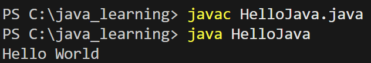

# Task1
- JDK
    - JRE（运行环境）
      - JVM（虚拟机）
      - JAVA核心类库
    - 开发工具（java javac）

1. JDK将.java翻译成.class
2. JRE提供运行环境
3. JVM翻译.class变成机器码

# Task2
- JAVA_HOME 记录JDK位置
- PATH 记录JDK内命令工具的位置
- 配置环境变量后，系统才有找到文件的路径

# Task3

1. javac将.java文件编译为字节码.class文件
2. java启动JVM，JVM执行.class文件
3. JVM转换.class为机器码，调用核心类库