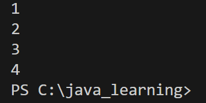
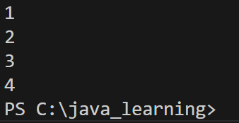
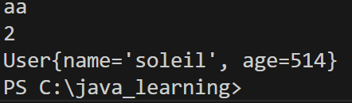

# Task1
- Q1
  - Map(键值对存储)
    - TreeMap(有序)
    - HashMap(无序)
  - Set(不重复)
    - TreeSet(排序，无索引)
    - HashSet(无序，无索引)
  - List(有序)
    - LinkedList(基于双链表（头尾开口），在内存中不连续，每结点包含值和下一结点地址，查询慢（沿链查询），删除、添加效率高)
    - ArrayList(基于数组，查询速率快（索引），删除、添加效率低（长度不易更改）)
  - 数组固定长度，而集合的长度能够增长

# Task2
- Q2
```java
public static void main(String[] args) {
    List<Integer> list = new ArrayList<>();
    list.add(1);
    list.add(2);
    list.add(3);
    list.add(4);
    for (int i : list){
        System.out.println(i);
    }
}
```

- Q3
  - 匿名内部类是 对于抽象类或者接口 无需创建子类实现对象 即可重写其函数 的方法
  - 函数式接口是 接口之中有且仅有一个需要重写的抽象函数 的接口
```java
public static void main(String[] args) {
    List<Integer> list = new ArrayList<>();
    list.add(1);
    list.add(2);
    list.add(3);
    list.add(4);
    list.forEach(integer -> System.out.println(integer));
}
```


# Task3
- Q4
```java
public interface Repository<A>{
    void save(int id, A data);//向仓库添加数据
    A getByld(int id);//根据id获取数据
}
public class MyRepository<A> implements Repository<A>{ 
    Map<Integer ,A> map = new HashMap<>();
    @Override
    public void save(int id,A data) {
        map.put(id,data);
    }

    @Override
    public A getByld(int id) {
        return map.get(id);
    }
}
public class User {
    private String name;
    private int age;

    public User(String name, int age) {
        this.name = name;
        this.age = age;
    }

    @Override
    public String toString() {
        return "User{name='" + name + "', age=" + age + "}";
    }
}
public void main(String[] args) {
    MyRepository myRepository = new MyRepository<>();
    int id = 0;
    String str = "aa";
    Integer i = 2;
    User user = new User("soleil", 514);
    myRepository.save(id++,str);
    myRepository.save(id++,i);
    myRepository.save(id++,user);
    for (int t = 0;t <= i;t++){
        System.out.println(myRepository.getByld(t));
    } 
}
```


# Task4
- Q5
```java
public class MockSongs {
    public static List<String> getSongStrings(){
        List<String> songs = new ArrayList<>();
        //模拟将要处理的列表
        songs.add("sunrise");
        songs.add("thanks");
        songs.add("$100");
        songs.add("havana");
        songs.add("114514");
        //TODO
        //在这里完成你的代码
        songs.sort(Comparator.comparingInt(String::length));
        //END
        return songs;
    }
}
public static void main(String[] args) {
    List songlist = MockSongs.getSongStrings();
    songlist.forEach(str -> System.out.println(str));
}
```