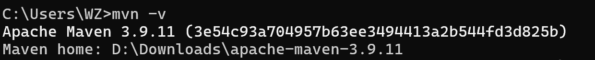
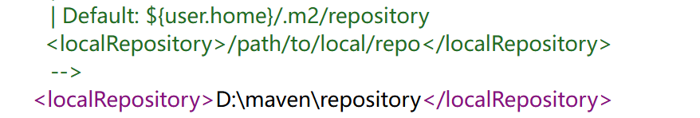
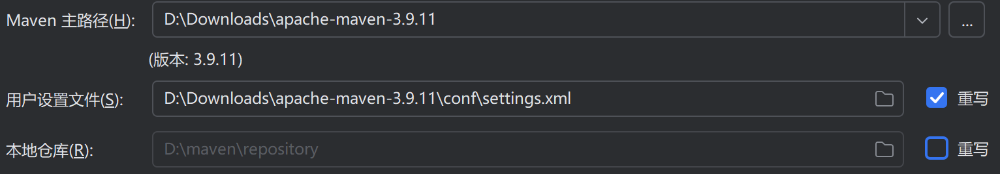

# Task1
## 1.什么是maven
1. maven是java的项目管理工具
2. jar包是已有的java相关的文件，打包在一起，在项目开发中可以直接在网上下载
3. maven为所有jar包安排了地址，在项目开发时，能快速下载项目所需的jar包以及它所依赖的jar包
4. - maven使项目开发更方便
   - 无需自己寻找jar包，避免版本不统一的问题
   - maven统一了java的开发结构
## 2.下载maven

## 3.maven仓库

- 远程仓库
  - 中央仓库：maven维护团队管理，全球共享的仓库
  - 私服：组织内部共享的仓库
## 4.maven项目
1. 
2. maven配置参数
    - 项目坐标
      - groupID
      - artifactID(项目名称)
      - version(版本)
      - packaging(打包方式)
    - 依赖
3. maven项目结构
    - project
      - pom.xml------maven的配置文件
      - src
        - main
          - java---------源代码
          - resources----源代码需要的配置文件
        - test
          - java---------测试代码
          - resources----测试代码需要的配置文件
      - target-------编译后自动生成(有报告)
4. pom.xml作用
    - 介绍项目信息
    - 管理依赖
5. 导入jar包
 - 添加依赖(在远程仓库中找jar包地址)
   - groupID
   - artifactID
   - version

## 5.启动maven
1. maven命令
   - mvn compile 编译
   - mvn clean   清理编译生成的文件
   - mvn test    测试
   - mvn package 打包(jar(jar包) war(web应用))
   - mvn install 安装到本地仓库

# Task2
- 客户端
```java
package myproject;

import java.io.OutputStream;
import java.net.HttpURLConnection;
import java.net.URL;
import java.nio.charset.StandardCharsets;
import java.util.Scanner;

import com.alibaba.fastjson.JSON;


//fastjson这个库需要定义一个类作为映射
class User {
    private String trackingNumber;
    private String phone;

    public User(String trackingNumber,String phone){
        this.trackingNumber = trackingNumber;
        this.phone = phone;
    }

    // 必须有无参构造函数
    public User(){}
    // 必须提供 getter/setter (Fastjson 依赖它们)
    public String gettrackingNumber(){
        return trackingNumber;
    }
    public String getphone(){
        return phone;
    }

    public void settrackingNumber(String trackingNumber){
        this.trackingNumber = trackingNumber;
    }
    public void setphone(String phone){
        this.phone = phone;
    }
}
public class Client {
    
    private static final String SERVER_URL = "http://localhost:8000/query";

    public static void main(String[] args) {
        Scanner scanner = new Scanner(System.in);

        while (true) {
            //读取用户输入的快递单号和手机号
            System.out.println("输入快递单号：");
            String trackingNumber = scanner.nextLine();

            if ("quit".equalsIgnoreCase(trackingNumber)){//用户输入quit退出
                break;
            }

            System.out.println("输入手机号：");
            String phone = scanner.nextLine();
            
            System.out.println("信息录入完成");
            try {
                /*
                用fastjson这个依赖构造json格式，构造的样例为
                {"trackingNumber":"SF123456789","phone":"19867653558"}
                */

                //然后通过给这个类实例化具体数据构建json
                User user = new User(trackingNumber, phone);
                String json = JSON.toJSONString(user);
            
                // 将这个json格式的数据写入请求体并发送HTTP POST请求
                try {
                    URL url = new URL(SERVER_URL);
                    
                    //打开连接
                    HttpURLConnection connection = (HttpURLConnection) url.openConnection();
                    connection.setRequestMethod("POST");//请求方法POST
                    connection.setDoOutput(true);//从服务器读取数据
                    connection.setConnectTimeout(3000);//设置等待时长
                    connection.setReadTimeout(3000);
                    //设置请求头
                    connection.setRequestProperty("Content-Type", "application/json; charset=UTF-8");
                    

                    //发送请求
                    try(OutputStream os = connection.getOutputStream()){
                        byte[] input = json.getBytes(StandardCharsets.UTF_8);//将json写入os流
                        os.write(input,0,input.length);//写出请求
                    }catch(Exception e){
                    }
                
                    // 读取响应，状态码是200才是响应成功
                    if (connection.getResponseCode() == 200) {
                    /*
                    解析服务端响应的json格式，拿到取件码，拿不到就显示msg的内容
                    样例：
                    例如：{"pick_code":4096,"msg":"success"}
                            {"pick_code":null,"msg":"手机号不正确"}
                    */
                        try(Scanner responseScanner = new Scanner(connection.getInputStream(),StandardCharsets.UTF_8)){
                            String jsonResponse = responseScanner.useDelimiter("\\A").next();//一次性读取全部响应
                            Response response = JSON.parseObject(jsonResponse, Response.class);

                            if (response.getpick_code() != null){
                                System.out.println("取件码："+response.getpick_code());
                            }else{
                                System.out.println(response.getmsg());
                            }
                        }
                        
                        
                    }else {
                        System.out.println("查询失败，状态码: " + connection.getResponseCode());
                    }
                }catch(Exception e){
                    System.out.println("未连接网络");
                }
            }catch (Exception e) {
                System.out.println("请求发生错误: " + e.getMessage());
            }
        }   

        scanner.close();
        System.out.println("客户端已退出");
    }
}
```
- 服务端
```java
package myproject;

import java.io.IOException;
import java.io.InputStream;
import java.io.OutputStream;
import java.net.InetSocketAddress;
import java.nio.charset.StandardCharsets;
import java.util.HashMap;
import java.util.Map;
import java.util.Scanner;

import com.alibaba.fastjson.JSON;
import com.sun.net.httpserver.HttpExchange;
import com.sun.net.httpserver.HttpHandler;
import com.sun.net.httpserver.HttpServer;

import myproject.Server.QueryHandler;

class Response{
        private String pick_code;
        private String msg;

        public Response(String pick_code,String msg){//有参构造
            this.pick_code = pick_code;
            this.msg = msg;
        }
        public Response(){}//无参构造
        //两个getter
        public String getpick_code(){
            return pick_code;
        }
        public String getmsg(){
            return msg;
        }
        //两个setter
        public void setpick_code(String pick_code){
            this.pick_code = pick_code;
        }
        public void setmsg(String msg){
            this.msg = msg;
        }
    }

public class Server {
    private static final int PORT = 8000;
    private static final Map<String, String> expressMap = new HashMap<>();

    
    public static void main(String[] args) throws IOException {
        // 初始化一些测试数据
        initializeExpressData();
        // 创建HTTP服务器，监听指定端口
        HttpServer server = HttpServer.create(new InetSocketAddress(PORT), 0);
        // 设置路由和处理程序
        server.createContext("/query", new QueryHandler());
        // 启动服务器
        server.start();
        System.out.println("Server started on port " + PORT);
    }

    private static void initializeExpressData() {
        // 添加一些测试数据
        //键的构成是  快递单号_手机号
        expressMap.put("SF123456789_13005433678", "1234");
        expressMap.put("JD987654321_19805433168", "5678");
        expressMap.put("YT456789123_13905479698", "9012");
        expressMap.put("ZT789123456_18505433664", "3456");
    }

    static class QueryHandler implements HttpHandler {
        @Override
        public void handle(HttpExchange exchange) throws IOException {
            if ("POST".equals(exchange.getRequestMethod())) {
                // 读取请求体
                InputStream requestBody = exchange.getRequestBody();//将请求体写入input流
                String request;
                try(Scanner scanner = new Scanner(requestBody,StandardCharsets.UTF_8)) {
                    request = scanner.useDelimiter("\\A").next();//将请求体写入request                    
                }

                try {
                    // 解析JSON请求（例如：{"trackingNumber":"SF123456789"}）获得单号
                    User user = JSON.parseObject(request, User.class);//将接收到的请求体解析到user
                    String trackingNumber = user.gettrackingNumber();
                    String phone = user.getphone();
                    // 在expressMap中查询取件码，
                    String pick_code = expressMap.get(trackingNumber+"_"+phone);
                    Response response;//创建Response实例

                    /*
                    构建响应的json
                    例如：{"pick_code":4096,"msg":"success"}
                    如果找不到快递则是{"pick_code":null,"msg":"根据各种情况写提示信息"}
                    */
                    if (pick_code != null){//单号和手机号码正确，拿到取件码
                        response = new Response(pick_code,"success");
                    }else{//单号或手机号码不对，返回“找不到快递”
                        response = new Response(pick_code,"找不到快递");
                    }

                    String jsonResponse = JSON.toJSONString(response);
                    // 发送响应
                    exchange.getResponseHeaders().set("Content-Type", "application/json; charset=UTF-8");
                    byte[] responsebyte = jsonResponse.getBytes(StandardCharsets.UTF_8);
                    exchange.sendResponseHeaders(200,responsebyte.length);//把response内容写入响应头

                    try(OutputStream os = exchange.getResponseBody()){
                        os.write(responsebyte);//返回响应
                    }
                } catch (Exception e) {
                    // 处理异常，返回400状态码(Bad Request)
                    String errorResponse = JSON.toJSONString(new Response(null,"Bad Requset"));
                    byte[] errorByte = errorResponse.getBytes(StandardCharsets.UTF_8);
                    exchange.getResponseHeaders().set("Content-Type", "application/json; charset=UTF-8");
                    exchange.sendResponseHeaders(400,errorByte.length);

                    try(OutputStream os = exchange.getResponseBody()){
                        os.write(errorByte);
                    }
                
                }
            } else {
                // 非POST请求返回405 Method Not Allowed
                String notPostResponse = JSON.toJSONString(new Response(null,"Method Not Allowed"));
                byte[] notPostByte = notPostResponse.getBytes(StandardCharsets.UTF_8);
                exchange.sendResponseHeaders(405,notPostByte.length);

                try(OutputStream os = exchange.getResponseBody()){
                    os.write(notPostByte);
                }
            }
        }
    }
}
```